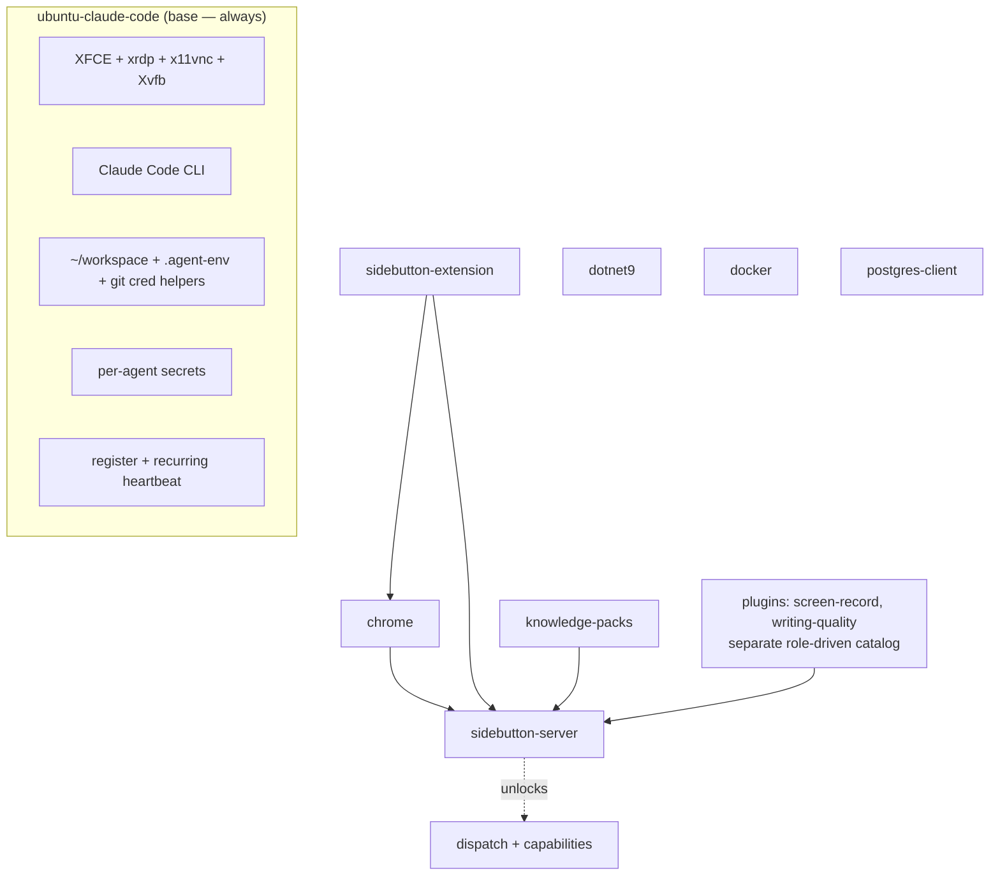

# SideButton Agent — Component Model & Implementation Plan

Status: proposal · Supersedes the 3-variant model · Source of truth for the
portal Create-Agent wizard (vendored via `scripts/sync-runner-catalog.mjs`).

## 1. Goal

Make the agent install **composable**: a minimal always-installed **base**, plus a
catalog of **optional components** (none required). The Create-Agent wizard offers
**profiles** that are just pre-checked sets of components; the user can uncheck or
add any item before provisioning.

Replaces the rigid `swe-full-stack / qa-generalist / swe-native / swe-bare`
variant matrix (one fixed toolchain for all) that left, e.g., GoStudent `.NET`
agents with no `dotnet`/`docker`/`psql`.

## 2. Architecture

- **One runner variant**, named after its deps: **`ubuntu-claude-code`**
  (Ubuntu + XFCE/RDP + Node + Claude Code). The `variants/` mechanism stays, but
  collapses to this single base; the old `*-extension` / `*-claude-code` variants
  are retired and their behaviour moves into components.
- **Base** = the minimal, dispatch-free agent that single variant installs.
- **Components** = optional, layered on top, selected per-agent via one env list
  `AGENT_COMPONENTS`.
- **Profiles** = named component presets (+ default roles) the wizard offers.



## 3. Base — what the single `ubuntu-claude-code` variant always installs

A complete agent that needs no server: operator can RDP in, clone the assigned
workspace repos (credential helpers are pre-wired), and run `claude` manually.

| Concern | Source step(s) today |
|---|---|
| Preflight, apt essentials, Node 22 | `01-preflight`, `02-system`, `05-node` |
| GitHub CLI | `03-gh-cli` |
| Desktop + RDP/VNC (xfce4, xrdp, x11vnc, Xvfb) + units | `04-desktop`, desktop units in `16/17` |
| Claude Code CLI + onboarding/trust seed | `07-claude-code`, `15b-claude-onboarding` |
| Agent user, RDP password, `~/.claude/settings.json`, dirs | `09-agent-user` |
| Polkit (RDP auth popups) | `11-polkit` |
| `~/.agent-env` template + `.bashrc` + **git credential helpers** + `~/workspace` | `12-workspace` |
| Per-agent secrets fetch | `19-secrets` |
| Wallpaper | `16b-wallpaper` |
| **Register + recurring heartbeat** (online) | `18-heartbeat` + **new `sb-heartbeat.timer`** |
| Install marker | `20-mark-installed` |

### Recurring heartbeat (new, base)

Today recurring "online" relies on the portal polling the SideButton server on
`:9876`. A base agent has no server, so base gains a lightweight timer:

```ini
# /etc/systemd/system/sb-heartbeat.timer  → OnBootSec=1min, OnUnitActiveSec=3min
# /etc/systemd/system/sb-heartbeat.service → POST $PORTAL_URL/api/agents/heartbeat
#   Authorization: Bearer $SIDEBUTTON_AGENT_TOKEN, X-Agent-Name: $AGENT_NAME
```

This keeps `agents.last_seen_at` fresh independent of any component.

## 4. Component catalog (`components.json`)

Infra components only — `kind` ∈ `runtime` / `packs` / `toolchain`. **MCP plugins are a
separate, role-driven catalog (`plugins.json`) — see §4b**, not components.

| slug | kind | Installs (migrated from) | requires | chip (live?) |
|---|---|---|---|---|
| `chrome` | runtime | `06-chrome` + `chrome.service` | — | Chrome (live) |
| `sidebutton-server` | runtime | `08-sidebutton` + `sidebutton.service` + `15-claude-mcp` + `14-claude-stop-hook` + `19c-health-report` + server start (`19b`) | — | SB server (live) — **unlocks dispatch + capabilities** |
| `sidebutton-extension` | runtime | ext `pre-services` (Chrome managed-policy force-install) + `post-services` (browser_connected wait) | `chrome`, `sidebutton-server` | Extension (live) |
| `knowledge-packs` | packs | `13-knowledge-packs` + `19d-account-registry` (+ update timer) | `sidebutton-server` | Knowledge packs |
| `dotnet9` | toolchain | **new** — Microsoft apt repo → `dotnet-sdk-9.0`; `DOTNET_ROOT` in `/etc/environment` | — | .NET 9 |
| `docker` | toolchain | **new** — `docker-ce` + `systemctl enable --now docker` + `usermod -aG docker $AGENT_USER` | — | Docker (live) |
| `postgres-client` | toolchain | **new** — `postgresql-client` | — | psql |
| `openvpn` | toolchain | **new** — `openvpn` + `sb-vpn-connect` helper; .ovpn applied manually post-provision (MVP — see [`OPENVPN.md`](./OPENVPN.md)) | — | VPN |
| `wireguard` | toolchain | **new** — `wireguard-tools` + `sb-wg-connect` helper; .conf applied manually post-provision (split-tunnel MVP — see [`WIREGUARD.md`](./WIREGUARD.md)) | — | VPN |

### `components.json` shape

```json
{
  "version": 1,
  "components": [
    { "slug": "chrome", "kind": "runtime", "label": "Chrome",
      "requires": [], "chip": { "label": "Chrome", "live": true } },
    { "slug": "sidebutton-server", "kind": "runtime", "label": "SideButton MCP server",
      "requires": [], "unlocks": ["dispatch", "capabilities"],
      "chip": { "label": "SB server", "live": true } },
    { "slug": "sidebutton-extension", "kind": "runtime", "label": "SideButton extension",
      "requires": ["chrome", "sidebutton-server"],
      "chip": { "label": "Extension", "live": true } },
    { "slug": "knowledge-packs", "kind": "packs", "label": "Knowledge packs",
      "requires": ["sidebutton-server"], "chip": { "label": "Knowledge packs", "live": false } },
    { "slug": "dotnet9", "kind": "toolchain", "label": ".NET 9 SDK",
      "requires": [], "chip": { "label": ".NET 9", "live": false } },
    { "slug": "docker", "kind": "toolchain", "label": "Docker",
      "requires": [], "chip": { "label": "Docker", "live": true } },
    { "slug": "postgres-client", "kind": "toolchain", "label": "PostgreSQL client",
      "requires": [], "chip": { "label": "psql", "live": false } }
  ]
}
```

Each component owns phase scripts under `base/components/<slug>/`:
`install.sh` (kind-specific), optional `pre-services.sh`, optional
`post-services.sh` — matching today's variant hook phases (so the extension's
policy-before-`chrome.service`-start ordering is preserved exactly).

## 4b. Plugins (separate role-driven catalog — `plugins.json`)

MCP **plugins** are Claude-Code-skill-like tools the SideButton server loads — **not** components.
They live only in `plugins.json` (install detail: `repo`/`ref`/`submodules`/`system_deps`) and each
carries `default_roles`, so the wizard pre-checks them **by role** (Step 2 of the Create-Agent wizard,
shown only when `sidebutton-server` is selected). The final selection threads to cloud-init as
`SIDEBUTTON_PLUGINS` (separate from `AGENT_COMPONENTS`); `19b-plugins.sh` installs each slug. Plugins
are optional and require the server.

| slug | default_roles | system_deps | installs |
|---|---|---|---|
| `screen-record` | `["*"]` (all roles) | `ffmpeg` | `19b-plugins` (`sidebutton plugin install`) |
| `writing-quality` | `["smm"]` | — | `19b-plugins` (`--recurse-submodules`) |

## 5. Profiles (presets — `profiles.json`)

| Profile (slug) | Pre-checked components | Default roles |
|---|---|---|
| **SideButton SWE Full Stack** (`swe-full-stack`, default) | `chrome, sidebutton-server, sidebutton-extension, knowledge-packs` | se, qa, sd, pm |
| **SideButton SWE .NET** (`swe-dotnet`, new) | Full Stack **+ `dotnet9`** | se, qa, sd, pm |
| **SideButton SWE Native** (`swe-native`) | `chrome, sidebutton-server, knowledge-packs` (no extension) | se, qa |

Plugins are selected separately, by role (§4b): `screen-record` for every role, `writing-quality` for `smm`.

Dropped: `qa-generalist`, `swe-bare`.

```json
{
  "version": 2,
  "default": "swe-full-stack",
  "order": ["swe-full-stack", "swe-dotnet", "swe-native"],
  "runner": "ubuntu-claude-code",
  "profiles": [
    { "slug": "swe-full-stack", "name": "SideButton SWE Full Stack",
      "runner": "ubuntu-claude-code", "default_roles": ["se", "qa", "sd", "pm"],
      "components": ["chrome", "sidebutton-server", "sidebutton-extension", "knowledge-packs"] },
    { "slug": "swe-dotnet", "name": "SideButton SWE .NET",
      "runner": "ubuntu-claude-code", "default_roles": ["se", "qa", "sd", "pm"],
      "components": ["chrome", "sidebutton-server", "sidebutton-extension", "knowledge-packs", "dotnet9"] },
    { "slug": "swe-native", "name": "SideButton SWE Native",
      "runner": "ubuntu-claude-code", "default_roles": ["se", "qa"],
      "components": ["chrome", "sidebutton-server", "knowledge-packs"] }
  ]
}
```

**The preset only pre-checks** — the wizard lets the user uncheck or add any
component. Example — GoStudent: choose **SWE .NET**, then add **`docker`** +
**`postgres-client`**.

## 6. Wizard UX (`CreateAgentWizard.astro`)

- **Step 1** — Profile dropdown (the 3 profiles above) + a **component checklist** beneath it,
  pre-checked from the preset.
  - **Dependency logic** (from `requires`): ticking `sidebutton-extension` auto-ticks `chrome` +
    `sidebutton-server`; unticking `sidebutton-server` unticks its dependents (extension, packs) and
    shows *"agent becomes non-dispatchable (no capabilities)."*
  - **VM-tier hint**: if `docker` is checked → recommend **L (16 GB)**.
- **Step 2** — Roles, plus a **Plugins picker** (`plugins.json`, §4b) shown only when
  `sidebutton-server` is selected; plugins pre-check **by role** (`screen-record` for every role,
  `writing-quality` for `smm`), user-editable, optional. Unticking `sidebutton-server` clears + hides it.
- Submit sends the final `components[]` **and** `plugins[]` (→ `AGENT_COMPONENTS` + `SIDEBUTTON_PLUGINS`).

## 7. Capabilities & dispatch gating

`sidebutton-server` is what enables dispatch + agent capabilities.

| Selection | `agents.capabilities` | Dispatchable? | Portal badge |
|---|---|---|---|
| includes `sidebutton-server` | profile/edited roles | yes | normal |
| no `sidebutton-server` | `[]` | no (dispatch keys off capabilities) | **Manual** |

## 8. agent-runners changes

- Add `components.json` + `components.schema.json` (infra only). `plugins.json` stays the **separate**
  role-driven plugin catalog (per-plugin `default_roles`); `19b-plugins.sh` installs `SIDEBUTTON_PLUGINS`.
- Add `base/components/<slug>/{install,pre-services,post-services}.sh` — move the
  existing bodies in verbatim for `chrome`, `sidebutton-server`,
  `sidebutton-extension`, `knowledge-packs`; add `dotnet9`, `docker`, `postgres-client`.
- `base/run.sh` → iterate `$AGENT_COMPONENTS` across phases (base desktop/RDP
  units always run):

  ```bash
  # phase order (per selected component, dependency-sorted):
  #   1. base steps (preflight … workspace, secrets)
  #   2. components: install.sh
  #   3. write systemd units (base desktop + per-component)
  #   4. components: pre-services.sh        # e.g. extension managed-policy
  #   5. start services
  #   6. components: post-services.sh       # e.g. extension handshake wait
  #   7. register + heartbeat + mark-installed
  ```

- Collapse `variants/` to the single `ubuntu-claude-code` (Ubuntu + Claude Code);
  retire `*-extension` / `*-claude-code (noext)` variants and **remove
  `fleet-job-client/`** + the bare hooks (base never handles dispatch/jobs).
- `profiles.json` + `profiles.schema.json` → the 3 presets; add `components`
  field; drop `qa-generalist` / `swe-bare`.
- Add the base `sb-heartbeat` service + timer.

## 9. Portal (`the-assistant`) changes

| File | Change |
|---|---|
| `scripts/sync-runner-catalog.mjs` | add `components.json` to the vendored set |
| `src/lib/cloud/profiles.ts` | `ProfileDef.components`; `resolveProfile` → final component set (preset ∪ edits); `capabilities` = roles only if `sidebutton-server` selected else `[]` |
| `src/lib/cloud/provisioner.ts` | `RunContext.components`; `buildUserData` emits `AGENT_COMPONENTS=…` (and `AGENT_RUNNER=ubuntu-claude-code`); persist `agents.components` |
| `src/pages/api/cloud/agents/provision.ts` | accept `components: string[]` |
| DB migration | `ALTER TABLE agents ADD COLUMN components TEXT DEFAULT '[]'` |
| `src/lib/cloud/profile-display.ts` | chips from `agents.components`; "Manual · not dispatchable" badge when no server |
| online status | accept base heartbeat (`last_seen_at`) as liveness; do not flag a serverless agent offline for a missing `:9876` |

`AGENT_COMPONENTS` cloud-init line example:

```bash
curl -sSf https://sidebutton.com/install.sh | sudo \
  AGENT_TOKEN=… AGENT_NAME=… AGENT_ROLE=… PORTAL_URL=… \
  AGENT_RUNNER=ubuntu-claude-code \
  AGENT_COMPONENTS=chrome,sidebutton-server,sidebutton-extension,knowledge-packs,dotnet9,docker,postgres-client \
  SIDEBUTTON_PLUGINS=screen-record \
  bash
```

## 10. No legacy

Legacy support is dropped — old agents are deleted and re-provisioned, so every agent has a populated
`AGENT_COMPONENTS` + `profile`. `base/components.sh` reads `AGENT_COMPONENTS` only (unset ⇒ a manual
base agent); the old `AGENT_RUNNER`→component-set mapping and the profile `aliases` are removed.

## 11. Rollout (parity-first)

1. **agent-runners — refactor with no behaviour change:** introduce the component
   model; re-express each *current* variant as a component preset and assert the
   generated install is **byte-identical** per variant (parity gate).
2. Remove `fleet-job-client` / bare / `qa-generalist`.
3. Add `dotnet9` / `docker` / `postgres-client` components + base `sb-heartbeat`.
4. **portal:** `AGENT_COMPONENTS`, capability/dispatch gating, online-via-heartbeat,
   unified chips, wizard checklist, `agents.components` migration, re-sync catalog.
5. **fleet:** re-provision GoStudent on **SWE .NET + docker + postgres-client**;
   `agent-hznzt-bob` keeps its user-local .NET 9 SDK for build-only until then.

## 12. Tests

- agent-runners: `components.json` schema validity; every `components[].slug`
  resolves to a `base/components/<slug>/`; parity snapshot per legacy variant.
- portal: `provisioner.test.ts` (`AGENT_COMPONENTS` emission + resolver
  precedence + capability gating), `profiles.test.ts` (3 presets, single runner),
  `profile-display.test.ts` (chips from a component set), runners-drift, migration.

## 13. Open items

- Default VM tier per profile (SWE .NET fine on M; +docker → L).
- Whether to also offer a named "Manual" (empty) preset, or leave it as
  "uncheck everything".
- `docker` security note: agent in the `docker` group ≈ root on the box —
  acceptable for a build/test agent; call it out in the wizard helper text.
